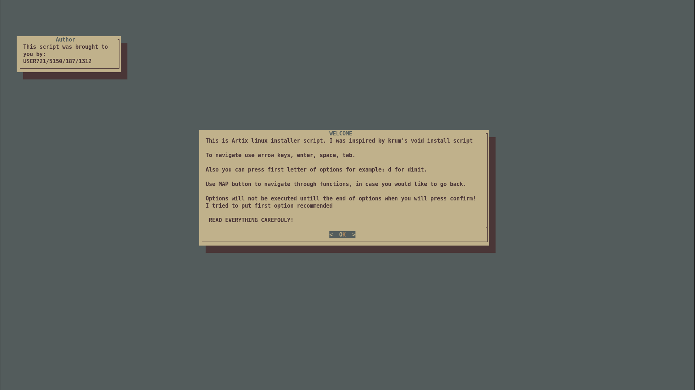

# TUI Artix Install Script

**to use it do:**

`git clone https://gitlab.com/user1312/ais`

`cd ais`

`./ais.sh or if you have bad inthernet ./ais.sh -b`

Features:

- Nice tui with themes

- Booster which is super fast initramfs
- Automatic/manual partition of disk
- Possible to mount more disks
- Filesystems: ext4,btrfs,xfs
- Swap: file, partition, zram, none
- Encryption of root partition (FDE in future)
- Inits: dinit, runit, openrc, s6
- Bootloader: refind, efi stub, limine
- Aur helper: yay,paru,tritzen,yaourtix,none
- Kernels: mainline, lts, zen
- Shells: bash,zsh
- Network: networkmanager,connman,iwd,dhcpcd
- DNS: possibility to change dns server using openresolv
- Graphics: nvidia,intel,amd,nouveau,legacy nvidia
- Some Environments: hyprland,kde,niri,bspwm and more
- Login Manager: sddm,greetd
- A lot of modules

`for pipewire to start you need to add to your autostart command: pipewire-launcher
for example in hyprland: exec-once = pipewire-launcher`

Script will not start untill you press yes in the final step

**This is my first bash script, i learned a lot. Its not best quality but i will work on it**

_thanks to krum for inspiration, check his viss script_

ToDo:
- [ ] Add Full Disk Encryption
- [ ] Add UKI Boot
- [ ] Add LVM disk support
- [ ] improve and clear code
